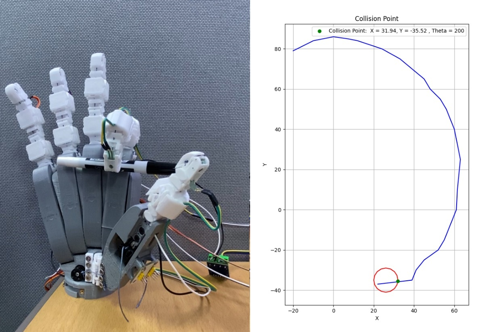
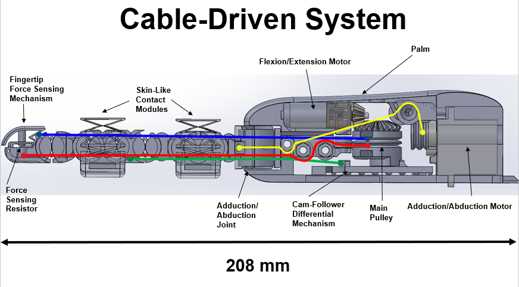
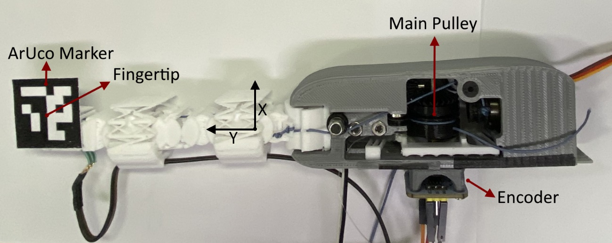
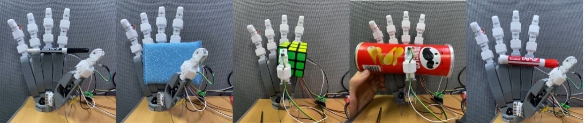
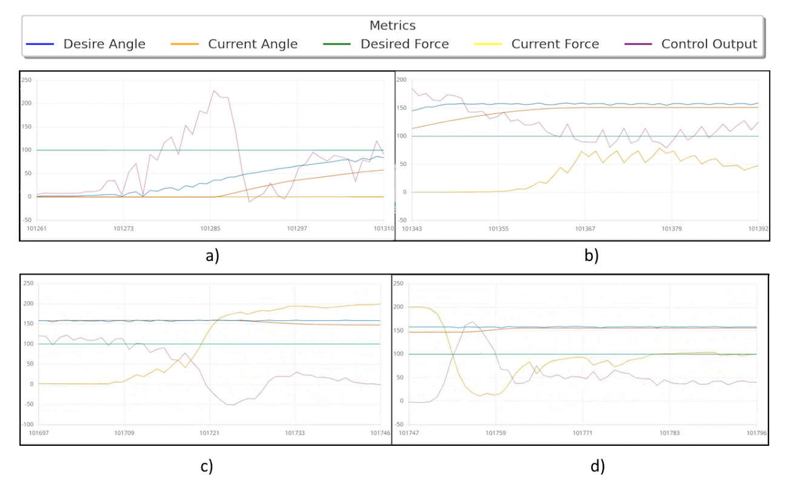

# open-yta-hand

**Underactuated anthropomorphic hand with integrated wrist — 7 DOF per finger, LSTM kinematics, impedance control, ~$8 per finger.**

[](https://dcollection.skku.edu/srch/srchDetail/000000181091?localeParam=en)
[](https://ieeexplore.ieee.org/document/10773068)
[](https://github.com/yourusername/monolithic-robotics)
[](LICENSE)

---

> *Yta* — "hand" in Muisca, the language of the pre-Columbian Chibcha civilization of the Colombian highlands.

---

## Overview

Open-Yta-Hand is a monolithic anthropomorphic robotic hand. The hand is modular:
five UMoBIC fingers assembled into a palm bracket, each finger independent and
using the same tendon coupling and actuation approach. Every joint in the finger
is a UMoBIC compliant revolute unit — printed in one session, no assembly of
structural parts. The control stack runs from ArUco motion capture data collection
through LSTM-based inverse kinematics to real-time impedance control on Arduino.

```
motion_capture/ → dataset/ → lstm/ → firmware/ → hardware
                                  ↓
                          simulation/mujoco
                                  ↓
                              rl/
```

<div align="center">
  
  <br><em>Physical prototype and computed fingertip trajectory with grasp collision point.</em>
</div>

---

## Repository Structure

```
open-yta-hand/
├── cad/
│   └── stl/
│   │    ├── arm/
│   │    │   ├── shoulder/
│   │    │   └── elbow/
│   │    ├── hand/
│   │    │   ├── finger/
│   │    │   ├── palm/
│   │    │   └── thumb/
│   │    └── wrist/
│   │
│   └── step/ full assembly
│       
│
├── motion_capture/          ArUco data collection, preprocessing
│   ├── dataset_collection.py
│   ├── marker_detection.py
│   ├── marker_creator.py
│   ├── serial_logger.py
│   ├── data_cleaning.py
│   └── data_slicing.py
│
├── dataset/                 Collected motion capture data
│   ├── finger_trajectory_dataset.csv
│   ├── train_data.csv
│   └── test_data.csv
│
├── kinematics/              Analytical and simulation models
│   ├── forward_kinematics.py
│   ├── continuum_ik.py
│   ├── optimization_ik.py
│   ├── finger_simulator.py
│   └── trajectory_simplifier.py
│
├── lstm/                    LSTM joint angle observer
│   ├── model.py
│   ├── train.py
│   ├── predict.py
│   └── weights/
│       └── lstm_inverse_kinematics.pth
│
├── simulation/
│   ├── mujoco/              MuJoCo model — exact physics, ground truth
│   │   ├── mjmodel.xml
│   │   ├── objects/pen.xml
│   │   └── meshes/
│   └── isaac_sim/           Isaac Sim simulation (in development)
│
├── rl/                      Reinforcement learning (SAC)
│   ├── env.py
│   ├── train.py
│   ├── play.py
│   ├── workspace_vis.py
│   └── weights/
│
├── firmware/
│   └── impedance_control/
│       └── impedance_control.ino
│
├── ros2_ws/                 ROS2 control package (in development)
│   └── src/umobic_finger/
│
├── docs/images/
├── requirements.txt
└── .gitignore
```

---

## Hardware

### The Finger — 208 mm, 7 DOF

Each finger is a single PETG print with all joints, pulleys, and skin modules in one session. Two motors drive the entire structure:

- **Motor 1 (JA12-N20, 1:150 + 2:1 bevel gear)** — flexion/extension via main cable routed through all phalanges
- **Motor 2 (MG90S servo)** — abduction/adduction via 90°-offset MCP joint
- **Cam-follower differential** — passively decouples DIP joint for precision tip grasps

<div align="center">
  
  <br><em>Internal mechanism: FSR-400 force sensing, skin modules, adduction joint, cam-follower differential, main pulley — 208 mm total.</em>
</div>

**Specs:**

| Parameter | Value |
|---|---|
| DOF per finger | 7 (6 flexion + 1 abduction) |
| Length | 208 mm |
| Weight | ~85 g |
| Cost (incl. actuators + sensors) | ~$8 USD |
| Material | PETG |
| Fabrication | Single FDM session (Creality Ender 3 V2 Neo) |
| Encoder | AS5600 magnetic (12-bit, I²C) |
| Force sensor | FSR-400 (0–10 N via fingertip transmission) |
| Microcontroller | Arduino (ATmega or equivalent) |

---

## Kinematics Pipeline

The cable-driven underactuated design couples all 6 flexion joints through a single tendon. Cable elasticity, friction, and the passive differential make the relationship between motor angle θ and fingertip position (x, y) highly nonlinear — impossible to capture analytically at high angles.

### 1. Forward Kinematics (analytical)

When the main pulley with radius r_p rotates by θ, the cable change distributes across n rolling-contact joints:

```
φᵢ = (r_p · θ) / (rᵢ · n)
```

The 2D simulator (`kinematics/finger_simulator.py`) visualizes this interactively — use arrow keys to rotate the pulley and watch all joints respond.

### 2. Continuum IK

Models the finger as a single-section continuum robot, computing bending angle and arc length from chord vector. Accurate at low angles, diverges at high angles due to unmodeled cable elasticity.

### 3. LSTM Joint Angle Observer

Selected over FNN, RNN, CNN, and Transformer after systematic comparison (see thesis Table 4.1). LSTM scored highest on temporal dependency handling, nonlinearity modeling, and robustness to noise — all critical for cable-driven compliant systems.

**Architecture:**
```
Input (x, y) → LSTM(64 hidden) → Linear → θ_motor
```

**Training:**
- Dataset: 4 runs × 2000 samples = ~8000 points
- Split: 75% train / 15% test
- Optimizer: Adam, lr=0.01, weight_decay=0.01
- Scheduler: lr × 0.5 every 10 epochs
- Epochs: 100, batch size: 32

**Results:**

| Metric | Value |
|---|---|
| Training loss | 0.6608 |
| Validation loss | 0.6884 |
| R² | **0.9998** |
| MSE | 0.6684 |
| RMSE | 0.8297 |
| MAE | 0.4291 |

---

## Motion Capture Setup

Data collection used a Logitech C270 camera, OpenCV, and ArUco markers to track fingertip (x, y, φ) while an AS5600 encoder measured pulley angle θ over serial.

<div align="center">
  
  <br><em>ArUco marker at fingertip, encoder at base. 500 samples per run × 4 runs.</em>
</div>

```bash
# 1. Print markers
python motion_capture/marker_creator.py

# 2. Collect data (camera port + Arduino serial port)
python motion_capture/dataset_collection.py

# 3. Log Arduino encoder output
python motion_capture/serial_logger.py

# 4. Clean and normalize
python motion_capture/data_cleaning.py

# 5. Split train/test
python motion_capture/data_slicing.py
```

---

## LSTM Training & Inference

```bash
# Train from scratch
cd lstm/
python train.py

# Run inference on new fingertip positions
python predict.py

# Monitor training
tensorboard --logdir logs/
```

**Quickstart inference:**
```python
from lstm.model import load_model
import torch

model = load_model("lstm/weights/lstm_inverse_kinematics.pth")

# Predict motor angle for fingertip at (31.94, -35.52)
x = torch.tensor([[[31.94, -35.52]]], dtype=torch.float32)
with torch.no_grad():
    theta = model(x).item()
print(f"θ_motor = {theta:.1f}°")  # → ~200°
```

---

## MuJoCo Simulation

The MuJoCo model represents all 9 joints with tendon equality constraints that
replicate the physical cable transmission exactly. Two position actuators drive
the structure at 500 Hz.

```bash
conda activate mujoco-env
python -m mujoco.viewer simulation/mujoco/mjmodel.xml
```

See `simulation/mujoco/README.md` for full model documentation.

---

## Reinforcement Learning

SAC policy trained entirely in MuJoCo simulation.
Observation: `[qpos(9), fingertip(3), target(3)]`.
Action: `[servo, motor]` normalized to `[-1, 1]`.

```bash
conda activate mujoco-env

# Train
python rl/train.py --steps 300000

# Watch training with viewer
python rl/train.py --steps 50000 --render

# Run trained policy
python rl/play.py --model rl/weights/best.zip

# Visualize reachable workspace
python rl/workspace_vis.py --steps 10000
```

---

## Impedance Control (Arduino)

`firmware/impedance_control/impedance_control.ino` implements a variable spring-mass-damper controller running at 100 Hz:

```
τ = K·(θ_desired − θ) + B·(−θ̇) + M·(−θ̈) − F_contact
```

**Key design decisions:**
- **Variable K and B** — stiffness halves when position error < 5°, damping reduces near zero velocity
- **Kalman filters** on velocity, acceleration, and contact force independently
- **SolidWorks-derived inertia** — M = 451.27 × 10⁻⁹ kg·m² from CAD model
- **Self-calibration on boot** — 30-sample FSR-400 offset averaging

| Parameter | Value |
|---|---|
| Stiffness K | 6.25 N/deg |
| Damping B | 2.25 N·s/deg |
| Inertia M | 451.27 × 10⁻⁹ kg·m² |
| Sample rate | 100 Hz |
| Encoder | AS5600, 12-bit |
| Force sensor | FSR-400, max 1000g |

---

## Grasping Results

Tested across 12+ object types including rigid (Rubik's cube, Pringles can), soft (sponge), and tool-shaped (marker, pliers) objects.

<div align="center">
  
  <br><em>Underactuated grasps: marker, sponge, Rubik's cube, Pringles can, tip grasp.</em>
</div>

<div align="center">
  
  <br><em>Impedance control metrics across four grasping trials.</em>
</div>

---

## 3D Printing

The `cad/stl/` folder contains STL files for the complete physical assembly:
finger, palm, thumb, wrist, shoulder and elbow.
Full mechanical context and assembly diagrams are in the thesis.

### Material

**PETG is strongly recommended over PLA.** PETG has higher elasticity which
gives more life cycles at the flexible joint layers before fatigue failure.
PLA is stiffer and will crack at the flex zones sooner under repeated actuation.

- Layer height: 0.2 mm is sufficient for all parts
- Supports: use tree-type supports — easier to remove from narrow flex zones

### Print orientation — critical

**Layer orientation is the most important parameter for this design.**
Flexible layers must be oriented so that layer lines run perpendicular to
the direction of motion. Parallel layer lines cause delamination under
repeated bending. Most parts use 2D geometry that grows vertically for
this reason. Print them standing upright as oriented in the STL files.

### Wrist — special handling required

> ⚠️ **Warning — experimental design**
>
> The wrist joint uses a 3D configuration unlike the 2D geometry of the
> finger and other joints. Correct layer orientation cannot be achieved
> for all surfaces in a single print. Parts printed as one piece have a
> higher risk of cracking at the flex zone under load.
>
> **Recommended approach:** print the wrist in two separate halves,
> keeping the critical flex surface correctly oriented in each half,
> then bond with cyanoacrylate or epoxy.

The elbow and shoulder follow the same 2D vertical geometry as the finger
and can be printed as single pieces. All arm joints should be considered
experimental — long-term fatigue behavior under repeated actuation has
not been fully characterized.

---

## In Development

**ROS2 control and simulation bridges** — architecture and implementation
are defined. MuJoCo bridge, Isaac Sim integration, and policy node are
implemented but require further debugging and testing.
See `ros2_ws/` and `simulation/isaac_sim/`.

**open-yta-hand-mk2** — a next-generation hand currently in development.
It follows the same design philosophy as the monolithic anthropomorphic hand
project and the UMoBIC finger. The mk2 builds on this foundation adding
better features for skin, force and shape sensing and more independent
degrees of freedom for easier control.

---

## Getting Started

```bash
git clone https://github.com/yourusername/open-yta-hand
cd open-yta-hand
pip install -r requirements.txt

# Interactive 2D finger simulator
python kinematics/finger_simulator.py

# MuJoCo simulation
conda activate mujoco-env
python -m mujoco.viewer simulation/mujoco/mjmodel.xml

# LSTM inference
python lstm/predict.py
```

---

## Publications

**ICCAS 2024**
> *Design of a Modular Anthropomorphic Hand with Integrated Monolithic Compliant Fingers and Wrist Joint*
> Gilberto Galvis Giraldo, Arpan Ghosh, Tae-Yong Kuc[[paper]](https://ieeexplore.ieee.org/document/10773068)

**Master's Thesis — SKKU 2024**
> *Monolithic Robotics with Cognitive AI: A Compliant Mechanism-Based Anthropomorphic Arm Design for Semantic Autonomous Manipulation*
> Gilberto Galvis Giraldo
> [[Full text]](https://dcollection.skku.edu/srch/srchDetail/000000181091?localeParam=en)

**Technical Report — 2023**
> *UMoBIC-Finger: A FACT-Based Compliant Revolute Joint for Monolithic Robotic Fingers*
> [[monolithic-robotics repository]](https://github.com/gigalgi/monolithic-robotics)

---

## Related Repositories

| Repository | Description |
|---|---|
| [monolithic-robotics](https://github.com/yourusername/monolithic-robotics) | Design framework — UMoBIC joint, FACT methodology, technical report |

---

## Author

**Gilberto Galvis Giraldo**
M.Sc. Electrical and Computer Engineering — Sungkyunkwan University, South Korea

---

## License

Apache License 2.0 — see [LICENSE](LICENSE) for details.
